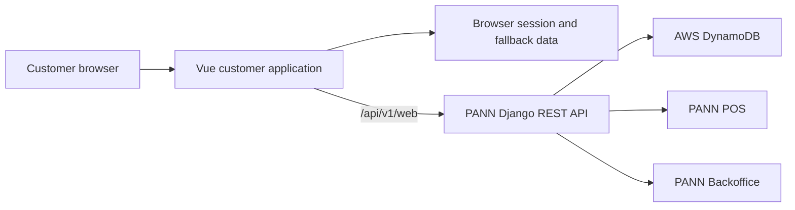

# Ramyeon Corner Customer Application

Mobile-friendly online ordering and loyalty experience for Ramyeon Corner customers. The application supports product discovery, promotions, pickup or delivery ordering, customer accounts, order tracking, and loyalty activity as part of the wider PANN capstone system.

[Live application](https://ramyeoncorner.com/) · [Backoffice](https://github.com/PANNRamyeon/Ramyeon-Backoffice) · [POS](https://github.com/PANNRamyeon/Ramyeon-POS) · [Shared backend](https://github.com/PANNRamyeon/Ramyeon-Backend)

## Project status

This is a team-built client capstone that has been deployed and evaluated. Development is presently paused. The README documents the current `main` branch; specialized stock-audit and architecture documents already in the repository remain available as supporting technical references.

There was no root README on `main` before this documentation refresh, so no legacy root file was created.

## Customer experience

- Responsive product menu with categories, search, and product details
- Promotions and voucher presentation
- Customer registration, login, profile, and settings
- Cart and checkout for pickup or delivery
- Online order creation, history, cancellation, and status tracking
- Loyalty points and QR-related customer flows
- Payment-history and PayMongo integration paths
- Local fallbacks for selected cart, session, and order-history behavior
- Restaurant information and contact pages

## Architecture



The application defaults to the shared hosted API and can be redirected through `VUE_APP_API_URL`. The authoritative backend source is [PANNRamyeon/Ramyeon-Backend](https://github.com/PANNRamyeon/Ramyeon-Backend).

## Technology stack

| Area | Technology |
|---|---|
| Framework | Vue 3.2, Vue CLI 5 |
| Routing and state | Vue Router 4, Pinia 3 |
| API client | Axios |
| Styling | Custom CSS, Tailwind/PostCSS tooling |
| Supporting features | QRCode, local browser storage |
| Deployment | Netlify |

## Repository structure

```text
src/
├── components/       Menu, cart, auth, profile, orders, promotions, and content
├── composables/      API and payment-related reusable logic
├── services/         Shared API clients
└── assets/           Brand, food, and interface assets
docs/                 Supporting Python requirements
*.md                  Stock-audit and architecture references
```

## Local setup

### Prerequisites

- Node.js 18 or newer
- npm
- Access to a compatible [PANN backend](https://github.com/PANNRamyeon/Ramyeon-Backend)

### Install and run

```bash
git clone https://github.com/PANNRamyeon/Ramyeon-Customer.git
cd Ramyeon-Customer
npm ci
```

Create `.env.local`:

```dotenv
VUE_APP_API_URL=http://localhost:8000/api/v1
```

Only browser-safe configuration belongs in `VUE_APP_` variables. Do not expose AWS, database, OAuth-client-secret, JWT, email-provider, or private payment credentials.

```bash
npm run serve
```

## Available commands

| Command | Purpose |
|---|---|
| `npm run serve` | Start the Vue development server |
| `npm run build` | Create the production build |
| `npm run lint` | Run the configured Vue/ESLint checks |

The repository also includes standalone stock comparison and diagnostic scripts. Review their configuration and use a non-production dataset before running any corrective operation.

## Testing and validation

The current package does not define a unified JavaScript test command. Standalone Python and browser diagnostic files exist for stock and order-history investigation, but they do not replace repeatable component, API-contract, or end-to-end tests.

Recommended coverage includes authentication and token refresh, cart persistence, checkout, order creation and cancellation, payment return flows, loyalty updates, responsive navigation, and accessibility.

## Deployment

`netlify.toml` builds the Vue application with Node 18, publishes `dist/`, applies SPA fallback routing, and adds standard security headers. Configure `VUE_APP_API_URL` in the deployment environment.

## Known limitations

- Several cart and order-history paths use browser storage as a fallback when API operations are unavailable.
- Automated frontend coverage and CI are not currently configured.
- Debug and stock-correction utilities remain in the repository root and should be separated from normal deployment workflows.
- API and authentication behavior depend on the separately deployed backend.
- Payment and order workflows require complete production integration testing.

## Related repositories

- [PANN Backoffice](https://github.com/PANNRamyeon/Ramyeon-Backoffice)
- [PANN POS](https://github.com/PANNRamyeon/Ramyeon-POS)
- [Ramyeon Customer](https://github.com/PANNRamyeon/Ramyeon-Customer)
- [PANN Backend](https://github.com/PANNRamyeon/Ramyeon-Backend)

## License

This repository is distributed under the [MIT License](LICENSE).
